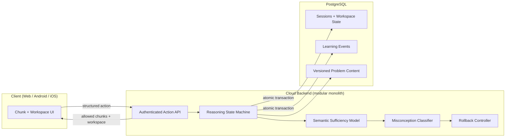

# Commitment-Gated Word Problem Tutor

> A cloud reasoning engine that teaches students to *structure* math word problems before they solve them.

[](#project-status)
[](#tech-stack)
[](#tech-stack)
[](#license)

---

## Table of Contents

- [Overview](#overview)
- [The Problem](#the-problem)
- [How It Works](#how-it-works)
- [Core Concepts](#core-concepts)
- [Architecture](#architecture)
- [Tech Stack](#tech-stack)
- [Repository Layout](#repository-layout)
- [Getting Started](#getting-started)
- [Action Protocol](#action-protocol)
- [Data Model](#data-model)
- [Canonical Examples](#canonical-examples)
- [MVP Scope](#mvp-scope)
- [Non Negotiable Rules](#non-negotiable-rules)
- [Security and Privacy](#security-and-privacy)
- [Roadmap](#roadmap)
- [Project Status](#project-status)
- [Contributing](#contributing)
- [License](#license)

---

## Overview

Most digital tutors show a full problem, wait for an answer, then react with a hint. This system does the opposite.

A word problem is split into ordered **semantic chunks**. Each chunk stays hidden until the student makes a valid **semantic commitment** about the chunk in front of them: what is the whole, what is the part, which operator the wording implies, what is still unknown. Commitments land in a **typed workspace** that enforces structural invariants. Attempts to compute before the information exists are detected, blocked, classified, and logged.

All reasoning logic lives on the server. Clients render and report actions, nothing more.

**Goal:** measurable improvement in structural reasoning, lower dropout, and a domain model that generalizes beyond arithmetic.

---

## The Problem

Students rarely fail word problems because of arithmetic. They fail because of:

- **Premature classification** of entities and quantities
- **Structural misunderstanding** of what relates to what
- **Early inferential collapse**, jumping to a number before the structure is known
- **Error propagation** from a single bad early assumption
- **Low tolerance for uncertainty**, which pushes them to guess rather than to wait

Answer checking cannot fix any of these, because it inspects the output rather than the reasoning state that produced it.

---

## How It Works

A walkthrough of canonical example **EX-01**.

> *"A class has 40 students. Thirty percent wear glasses. How many students wear glasses?"*

| Step | Visible to student | Required commitment | Engine behavior |
|------|--------------------|---------------------|-----------------|
| 1 | `A class has 40 students.` | Assign `40 students` to the **Whole** slot | Valid. Chunk 2 unlocks |
| 2 | `Thirty percent wear glasses.` | Assign `30%` to **Part in percentage**, identify the subset | Placing `30%` in Whole is rejected and blocks progression |
| 3 | `How many students wear glasses?` | Mark the unknown as **Part in number** | Structure is now complete, solution is permitted |
| 4 | Solution stage | Compute | `12 students` |

If the student instead places `40 students` in **Part in number** and later tries `30%` in **Whole** (example EX-04), both assignments are rejected as structurally inconsistent, the misconception class is recorded, and progression stays blocked until the conflicting assignments are **explicitly deleted**. Nothing is silently auto corrected.

---

## Core Concepts

The engine is five cooperating layers.

| Layer | Responsibility |
|-------|----------------|
| **1. Semantic Chunk Engine** | Partitions a problem into ordered semantic units: quantitative expression, entity reference, relational phrase, event defined subset, unknown designation |
| **2. Commitment Gated Disclosure** | Holds the next chunk until the current commitment validates. No look ahead, no full problem reveal |
| **3. Typed Workspace** | Typed slots (Whole, Part in percentage, Part in number, Relational operator, Unknown) with enforced invariants. Conflicts require deletion before progression |
| **4. Premature Commitment Detection** | Maintains a semantic sufficiency model, tracks satisfied dependencies, blocks quantification or relation selection before operands are known, and requires explicit acknowledgment of insufficient information |
| **5. Adaptive Rollback Controller** | On a detected misconception, rollback depth is chosen by misconception class. Repeated errors increase granularity and modulate strictness |

---

## Architecture

Fully cloud based. The client is a rendering surface with no reasoning logic.



**Server responsibilities:** state transitions, sufficiency evaluation, misconception classification, rollback, logging, analytics, engine versioning.

**Client responsibilities:** authenticate, fetch the current stage, render the visible chunk and workspace, emit structured action events, render the engine response.

---

## Tech Stack

Defaults from the Product Book, finalized in `ARCHITECTURE.md`.

| Concern | Choice |
|---------|--------|
| Language | TypeScript, strict mode, frontend and backend |
| Shape | Modular monolith, not microservices |
| Database | PostgreSQL with provider portability (local Postgres or Supabase Postgres) |
| Contracts | Schema validated request and response contracts (Zod) |
| Auth | Proven authentication provider, JWT bearer tokens |
| Mobile | Web UI wrapped with Capacitor for Android and iOS |
| Config | One validated configuration module backed by environment variables |
| Deploy | Containerized backend with health check and reproducible startup |

---

## Repository Layout

```text
.
├── apps/
│   ├── api/               # HTTP API, auth, action endpoint
│   └── web/               # Client UI, wrapped by Capacitor for mobile
├── packages/
│   ├── engine/            # Pure reasoning engine, no I/O, fully unit tested
│   ├── contracts/         # Shared request/response schemas and types
│   └── db/                # Schema, migrations, repositories
├── content/               # Versioned problem definitions and chunk data
├── doc/                   # Product Book, ARCHITECTURE.md, slice mapping
└── tests/
    ├── unit/
    ├── integration/
    └── fixtures/          # Canonical example seed data (EX-01 to EX-04)
```

---

## Getting Started

### Prerequisites

- Node.js 20 or later
- pnpm 9 or later
- PostgreSQL 15 or later, local or hosted
- Docker, optional, for the containerized backend

### Setup

```bash
git clone <repository-url>
cd <repository>

pnpm install
cp .env.example .env      # fill in database URL and auth secrets

pnpm db:migrate
pnpm db:seed              # loads canonical examples EX-01 to EX-04

pnpm dev                  # API + web client
```

### Verify

```bash
pnpm test                 # unit + integration
pnpm test:engine          # pure engine suite, no database required
pnpm lint && pnpm typecheck
```

### Mobile builds

```bash
pnpm build:web
pnpm cap sync
pnpm cap open android     # or: pnpm cap open ios
```

---

## Action Protocol

Every student action is idempotent and version checked.

### Request

```json
{
  "client_action_id": "018f2c6e-4a1b-7c3d-9f10-2b8e5a4c1d77",
  "session_id": "c9a2f7b1-3d55-4e08-8f21-6a0d9c4e77b2",
  "expected_state_version": 7,
  "action_type": "ASSIGN_SLOT",
  "payload": {
    "slot": "WHOLE",
    "value": { "kind": "quantity", "amount": 40, "unit": "students" }
  }
}
```

### Response

```json
{
  "state_version": 8,
  "outcome": "ACCEPTED",
  "visible_chunks": [
    { "index": 1, "text": "A class has 40 students." },
    { "index": 2, "text": "Thirty percent wear glasses." }
  ],
  "workspace": {
    "WHOLE": { "kind": "quantity", "amount": 40, "unit": "students" },
    "PART_PERCENTAGE": null,
    "PART_NUMBER": null,
    "UNKNOWN": null
  },
  "allowed_actions": ["ASSIGN_SLOT", "DELETE_ASSIGNMENT", "DECLARE_INSUFFICIENT"],
  "required_next_action": "ASSIGN_SLOT",
  "engine_version": "1.0.0",
  "content_version": "2026.07.1"
}
```

### Server guarantees

- A repeated `client_action_id` is processed **once** and returns the original result
- A stale or out of order `expected_state_version` is rejected safely, never applied
- Session state update and the learning event persist in **one database transaction**
- The response exposes only the chunks and actions currently permitted, never future hidden chunks or the full problem

### Outcome codes

| Code | HTTP | Meaning |
|------|------|---------|
| `ACCEPTED` | 200 | Commitment validated, state advanced |
| `STALE_STATE_VERSION` | 409 | Client state is behind, refetch and retry |
| `PREMATURE_COMMITMENT` | 422 | Required dependencies are not yet satisfied |
| `INVARIANT_VIOLATION` | 422 | Assignment contradicts the typed workspace rules |
| `DELETION_REQUIRED` | 422 | A conflicting assignment must be deleted before progression |
| `FORBIDDEN` | 403 | Session does not belong to the authenticated user |

> The payload shapes above are illustrative. The authoritative contracts live in `packages/contracts`.

---

## Data Model

Core entities:

`Users` · `Programs` · `Problems` · `Chunks` · `Sessions` · `Stage Attempts` · `Events` · `Misconception Classes` · `Rollback Logs`

Every active session persists enough durable state to resume exactly after refresh, app restart, or network loss:

- User and problem identity
- Current reveal position
- Workspace state
- Accepted commitments
- Required next action
- State version, engine version, content version
- Completion status

**Two separate log streams:**

| Stream | Contents |
|--------|----------|
| **Learning events** | Structured student actions, outcomes, misconception class, rollback, engine and content versions |
| **Operational logs** | Action start, completion, duration, failures. No secrets, no unnecessary personal data |

---

## Canonical Examples

These four examples are product truth. Seed data, fixtures, and tests must preserve their behavior.

| ID | Domain | Structural lesson | Result |
|----|--------|-------------------|--------|
| **EX-01** | Percentage | Distinguish Whole from Part in percentage | `12 students` |
| **EX-02** | Ratio | A ratio without scale cannot produce a number, answering early is a premature commitment | `10 red marbles` |
| **EX-03** | Fraction | The unknown is the complementary unread part, not the stated fraction | `20 pages remain unread` |
| **EX-04** | Conflict and rollback | Inconsistent assignments require explicit deletion, repeated equivalent errors trigger deterministic rollback | Blocked until resolved |

---

## MVP Scope

**In scope**

- Word problems only: percent, ratio, fraction
- Progressive chunk disclosure with commitment gating
- Typed workspace with enforced invariants
- Premature commitment detection and deterministic rollback
- Structured learning event logging
- Versioned, validated seed content

**Out of scope for MVP**

- Geometry and generalized algebra
- AI generated dynamic problems
- Analytics dashboard, event logging is required, visualization is not
- Any reasoning logic on the client

The engine must remain expandable to algebra, logic problems, and other structured reasoning domains without redesign.

---

## Non Negotiable Rules

Release blockers, not preferences.

- [ ] No reasoning logic in the mobile or web client
- [ ] No event and state split, each accepted action and its event persist atomically
- [ ] No full problem reveal bypass through any public endpoint
- [ ] No implicit auto corrections without structural validation
- [ ] Deletion is required before progression when a conflicting assignment violates an invariant
- [ ] No production `TODO`, mock, stub, fake authentication, in memory persistence fallback, or disabled required test
- [ ] Seed and fixture data for all canonical examples exist under the repository test and seed structure

---

## Security and Privacy

- Real, server validated authentication. Token based (JWT)
- Every session belongs to exactly one authenticated user
- Authorization enforced on the server, never in the UI alone
- A user cannot read or modify another user's sessions, actions, or learning history
- Minimal PII stored, user identity separated from behavioral analytics
- HTTPS only in transit
- Built toward GDPR and Israeli privacy compliance

---

## Roadmap

| Phase | Deliverable |
|-------|-------------|
| 1 | Pure TypeScript engine, contracts, full unit test suite, no I/O |
| 2 | Database foundation: schema, migrations, auth, seeded canonical content |
| 3 | Authenticated action API plus a thin web test UI |
| 4 | Capacitor mobile builds for Android and iOS |
| 5 | Analytics layer: premature commitment rate, rollback distribution, time to structural stability, misconception transition matrix, dropout signals |
| 6 | Domain expansion: algebra, logic, further structured reasoning domains |

---

## Project Status

Pre release, MVP in development. Interfaces and schemas may change without notice until the first tagged release.

---

## Contributing

1. Read `doc/PRODUCT_BOOK.md` first. It is the authoritative product source and overrides code comments and prior decisions.
2. Every Must requirement maps to a slice and to acceptance evidence. Keep that mapping current.
3. Changes to engine behavior require a matching test that encodes the structural rule, not just the numeric result.
4. Canonical example behavior may not change without a Product Book change.

---

## License

To be determined before public release.
